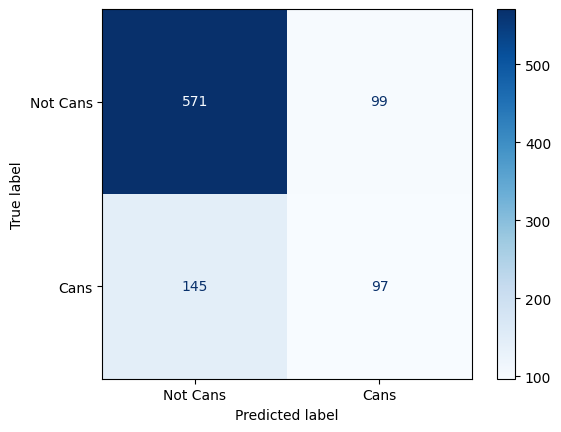

I made this to get experience with training a model from true scratch. I acquired, manually labeled, and augmented a dataset of ~6000 images and then trained and iterated on many models to get the best performance out of very few samples with a massive class imbalance. Follow along for my adventures in the worlds of deciphering dataset ambiguity, insightful image inspection, and convolutional confusion. This is a work in progress so don't be surprised if there are some missing sections as I keep working on this problem.

# Dataset Acquisition
The dataset used to train the models is the entirety of Guayaki's instagram page (https://www.instagram.com/guayaki/) as of November ~30th 2022. 5922 images were scraped using [instaloader](https://instaloader.github.io/)

# Labeling
To label the dataset I used Azure's dataset labeling tool because it's free and advertised a cool ml-assisted labeling feature where it generates models on previous predictions and helps predict labels as you go.

Overall the UI felt unfinished and I can't recommend anyone use it for serious tasks. For example why on earth do I have to click in the image EACH TIME to use hotkeys, and why can I only have 9 hotkeys that I can't customize whatsoever?

Anyways,

The classes are as follows:
* Cans
    * Enlightenmint
    * Revelberry
    * Bluephoria
    * Lemon
    * Other
    * Slim
        * Gold
        * Cranpom
        * Blackberry
        * Grapefruit Ginger
        * Lima Limon
        * Other
* Bottles
    * Mint
    * Raspberry
    * Original(Traditional)
    * Passion
    * Other
* No Yerb

I am missing some products (Orange, Tropical, Peach, and many limited runs to name a few) but given the small dataset and huge bias towards "No Yerb" I'll likely have to merge classes anyways.

Images were labeled with a few rules in mind:

* Any instance counts even if it's barely in frame
* Tea, stickers, etc do not count
* If I'm unsure what something is (eg. too blurry but it's definitely a bottle) I pick the base class (Bottle in this case)
* Anything that can be identified but doesn't have a class gets assigned Other (eg. a peach bottle is tagged as Bottles/Other)
* 2 different instances in the same image get tagged (eg. Mint and Lemon cans in the same image would be tagged as Cans/Enlightenmint, Cans/Lemon)

Some were pretty easy: https://i.imgur.com/MbH91SV.png  
Should this count?: https://i.imgur.com/t1cE6iM.jpg (No)  
This?: https://i.imgur.com/OQMGMOX.jpg (Yes, I guess...)

# A word on class imbalance
After labeling the class distribution was as follows:
[TODO]()

I use the class_weight parameter in keras to partially address this but the imbalance is still pretty brutal with some classes having under 50 instances. I don't expect good performance on these even with repetition & augmentation but the more popular classes should still be usable.

# Data Preperation and Augmentation
Images go through the following preparation pipeline to increase the number of training samples:
1. Load from disk
2. Normalize to [-1, 1]
3. Duplicate the image
4. Random rotation and translation applied the the duplicate
5. Both images added to the dataset

Labels go through the following pipeline to handle certain items belonging to multiple classes. For example, the class `Cans/Slim/Cranpom` belongs to the classes `"Cans"`, `"Cans/Slim"` and `"Cans/Slim/Cranpom"`. We want a way to represent this in a (multi) one-hot array.
1. Load image labels from the `.csv` Azure nicely provides
2. Augment the label array with base classes like in the above example
3. Multi-hot encode the labels. `["Cans", "Cans/Lemon"]` -> `[1,0,0,1,...]`

# Model Architecture
I tried *many* different convolutional architectures for this experiment, however ~6000 images doesn't seem to be enough to train anything useful. (Especially with such a huge class imbalance.) Most architectures consistently suffered from non converging validation accuracy and loss. It was very usual to see training accuracy steadily increase from ~30% to ~80% over ~20 epochs while validation accuracy quickly hit a ceiling of ~65% and then fluctuated for the rest of training. "Doubling" the size of the dataset through repetition & augmentation did produce better precision and recall for the most represented classes (Cans, Bottles, No Yerb) but didn't seem to have an effect on the less represented ones.

Here's a few typical confusion matrices for the models I tried. We can see that the model is relatively good at predicting "No Yerb" but struggles with all other classes. This is likely due to the class imbalance and the fact that the model is trained on a very small dataset.
<table>
  <tr>
    <td>Cans</td>
     <td>Cans/Enlightenmint</td>
     <td>Bottles</td>
     <td>No Yerb</td>
  </tr>
  <tr>
    <td></td>
    <td></td>
    <td></td>
    <td></td>
  </tr>
 </table>

Because of the afformentioned problems, transfer learning was the way to go. 
## Xception

### Global Average Pooling -> Output
* Image Resolution: 256x256
* Batch Size: 64
* Learning Rate: 0.0001
* Optimizer: Adam
* Epochs: 48 
 
**Results:**
* Training Accuracy: 0.5733
* Validation Accuracy: 0.6172
* Average F1 Score: 0.19

Validation and training accuracy were right in line with eachother the whole time. This was a good sign the model is generalizing, but sadly generalizing on garbage because both accuracies were pretty low. The F1 score was also pretty abysmal. Looking at the confusion matrices it seems to do well on `No Yerb` and `Cans` (the 2 most represented classes) as expected. `No Yerb` did have a much improved F1 score of 0.76 which gives at least a little bit of promise for the future.
<table>
  <tr>
    <td></td>
     <td></td>
     <td></td>
     <td></td>
  </tr>
  <tr>
    <td></td>
    <td></td>
    <td></td>
    <td></td>
  </tr>
 </table>

### Global Average Pooling -> Dense() -> Output
* Image Resolution: 256x256
* Batch Size: 64
* Learning Rate: 0.0001
* Optimizer: Adam
* Epochs: 38

# Results
* Training Accuracy: 0.6775
* Validation Accuracy: 0.6975
* Average F1 Score: 0.04

Accuracies were much higher with this, but the F1 score was ABYSMAL. The model has a massive bias towards `No Yerb`, unlikely that adding more dense layers was the right decision.
<table>
  <tr>
    <td></td>
    <td></td>
  </tr>
  <tr>
    <td></td>
    <td></td>
  </tr>
 </table>

# Future Work
I'd like to try a few things to improve the results:

* Train on a larger dataset. Ideally I would use a dataset of ~100k images with a more even class distribution.

